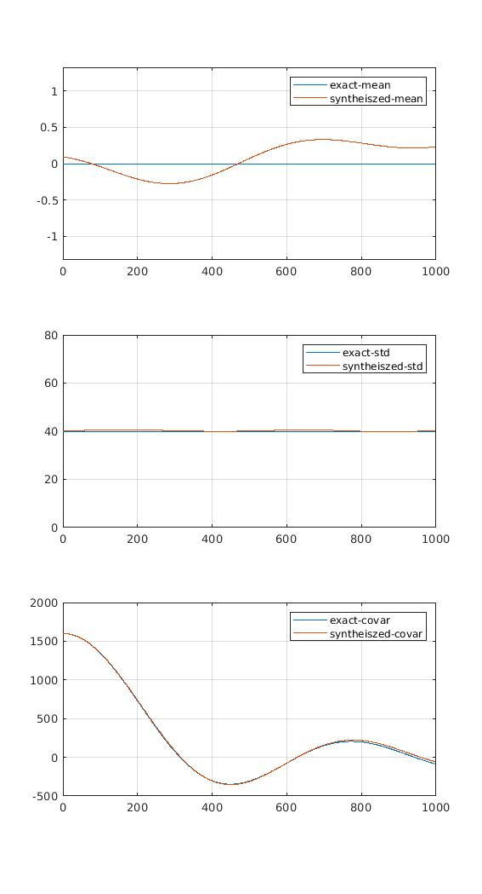

# Harmonic_representation_of_a_random_process

This code exemplifies the procedure to quantify a weakly stationary Gaussian random
process using spectral representation. The spectral representation are
essentially sum of many harmonic random processes. It utilizes fourier tranformation
to tranform the covariance function into power spectral density function.
The amplitude values in the harmonic function is computed easily by using the
power spectra density function.

Book <<Random vibration theory and practice>> by Paul Wirsching et al. is
followd. See page 92, 124, 127 of the book for details.

The example below is a low-pass random process with cutting off
frequency to be 1, and can be found in page 127 of the book.

